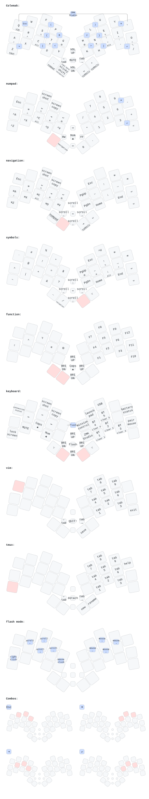
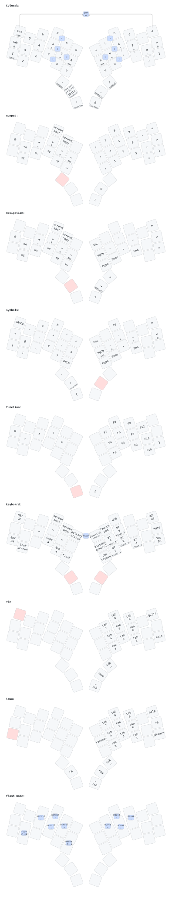

# Patagona Keyboards ZMK Firmware

This repo contains the firmware for the [Patagona Keyboards][patagona].

To use it, you have two choices:

- download the pre-compiled firmware from the Actions tab of this repository.
- create your own custom firmware.

## Download pre-compiled firmware

The pre-compiled firmware comes with the keymap shown at the bottom of this page,
and also includes [ZMK Studio][studio] that allows you to customize the keymap to
your preferences.

Go into the latest successful "Build default firmware" workflow run
from the [Actions tab][actions] of this repository,
scroll to the Artifacts section at the bottom of the page,
and click on the "firmware" link to download the zipfile.
Note that you must be signed in to github to download.

Unzip the firmware to find the following firmware files:

- gigas-unibody: for using the Patagona gigas keyboard without a dongle
- gigas-peripheral: for using the keyboad with a dongle
- gigas-dongle: to install the firmware onto the [Prospector ZMK dongle][prospector]
- chaski-unibody: for using the Patagona chaski keyboard without a dongle
- chaski-peripheral: for using the keyboad with a dongle
- chaski-dongle: to install the firmware onto the [Prospector ZMK dongle][prospector]
- xiao-ble-reset: used to clear all bluetooth connections and other saved settings

Plug the Patagona keyboard into your computer's USB port,
double-tap the reset button on the keyboard,
and then copy the appropriate firmware file matching your configuration
onto the new shared drive, which should be labeled something like
XIAO-SENSE for the Xiao BLE.

Your computer will likely give you an error,
since installing the firmware causes the keyboard to immediately reset,
which the computer dislikes, but you can safely ignore the error
and start using the keyboard.

## Create your own firmware

Follow the instructions for [creating your own ZMK firmware repo][zmk]
but note that the Patagona keyboards are out-of-tree keyboards so you will not
find them in the list of keyboards, but don't panic, we will make the necessary
changes to get your repo working.

Add this module to your `config/west.yml` by adding a new entry to both
`remotes` and `projects`:

```yaml
manifest:
  remotes:
    - name: zmkfirmware
      url-base: https://github.com/zmkfirmware
    - name: ctranstrum # <-- add this for the keyboard
      url-base: https://github.com/ctranstrum
    - name: caksoylar # <-- and this for the LED
      url-base: https://github.com/caksoylar
    - name: carrefinho # <-- if you want a dongle you can use this or another adapter
      url-base: https://github.com/carrefinho
    - name: englmaxi # <-- another option for a dongle
      url-base: https://github.com/englmaxi
  projects:
    - name: zmk
      remote: zmkfirmware
      revision: v0.3
      import: app/west.yml
    - name: patagona-zmk # <-- add this for the keyboard
      remote: ctranstrum
      revision: v0.3
    - name: zmk-rgbled-widget # <-- and this for the LED
      remote: caksoylar
      revision: v0.3
    - name: prospector-zmk-module # <-- something like this for the dongle
      remote: carrefinho
      revision: v0.3
    - name: zmk-dongle-display # <-- alternate dongle
      remote: englmaxi
      revision: v0.3
  self:
    path: config
```

Then, choose one of the following to add to your `build.yaml` file:

For a Patagona gigas:

```yaml
include:
  - board: seeeduino_xiao_ble
    shield: gigas_unibody rgbled_adapter
    snippet: studio-rpc-usb-uart
    artifact-name: gigas-unibody
```

For Patagona gigas with a dongle:

```yaml
include:
  - board: seeeduino_xiao_ble
    shield: gigas_dongle prospector_adapter
    snippet: studio-rpc-usb-uart
    artifact-name: gigas-dongle
  - board: seeeduino_xiao_ble
    shield: gigas_peripheral rgbled_adapter
    artifact-name: gigas-peripheral
```

For a Patagona chaski:

```yaml
include:
  - board: seeeduino_xiao_ble
    shield: chaski_unibody rgbled_adapter
    snippet: studio-rpc-usb-uart
    artifact-name: chaski-unibody
```

For Patagona chaski with a dongle:

```yaml
include:
  - board: seeeduino_xiao_ble
    shield: chaski_dongle prospector_adapter
    snippet: studio-rpc-usb-uart
    artifact-name: chaski-dongle
  - board: seeeduino_xiao_ble
    shield: chaski_peripheral rgbled_adapter
    artifact-name: chaski-peripheral
```

Modify your `config/gigas.conf` or `config/chaski.conf` file with these suggested changes:

```conf
# Enable mouse emulation
CONFIG_ZMK_POINTING=y

# Enable ZMK Studio
CONFIG_ZMK_STUDIO=y
```

See the pre-compiled firmware [gigas config file][gigas-config]
or [chaski config file][chaski-config]
for additional settings you may want to consider.

To customize the keymap for your Patagona keyboard,
you can copy the [default gigas keymap][gigas-keymap]
or [default chaski keymap][chaski-keymap] from this repo
to the `config` directory of your zmk config repo
and edit it from there.

## Default Gigas Keymap

The keymap starts off by using Colemak-DH as the base,
but it is missing the B and J keys.
You can access those keys by using combos:
press P and G simultaneously for B,
and M and L for J.

Additional two-finger combos using the middle and index finger are used for brackets:

- { and } are S-T and N-E (home row on each hand)
- ( and ) are F-P and L-U (top row on each hand)
- \[ and \] are C-D and H-, (bottom row on each hand)
- < and > are T-V and N-K (inner column on each hand)

The following keys are available via either
three-finger combos (using the index, middle, and ring fingers)
or two-finger combos (using the pinky and ring fingers):

- Escape is Q-W and W-F-P (top row left hand)
- Tab is Z-X (bottom row left hand) and R-S-T (home row left hand)
- Backspace is L-U-Y and Y-' (top row right hand)
- Enter is N-E-I (home row right hand) and .-/ (bottom row right hand)

Shift keys for punctuation has changed a little from the default:

- Shift ' for " (same as a default keyboard)
- Shift , for ;
- Shift . for :
- Shift / for \\

Modifier keys are available as holds under the home row keys on each hand.
Command is under the index finger (T and N).
Opt is under the middle finger (S and E).
Ctrl is under the ring finger (R and I).
Shift is under the pinky (A and O).
Globe does not work exactly the same as on a native Mac keyboard
due to design choices Apple made,
but you can get most of its functionality,
accessed by holding the inner column home row key (G and M).

The reachy left thumb key is a sticky shift.
Tap it once to capitalize the next letter typed.
Tap twice to enter a smart word capitalization mode
that automatically exits when you finish typing a word
(for example, press space when done).

Hold the tucky left thumb key to get a numpad under your right hand,
as well as to access `ctrl` editing commands under your left hand.
The reachy left thumb puts navigation keys under the right hand,
along with `cmd` editing commands under the left.

The reachy right thumb key is the space bar,
and when either right thumb key is held,
you get symbols under the left hand
and navigation under the right.

The mouse can be moved using the keyboard
by using vertical combos atop the location of each arrow key.
Similarly, mouse scroll can be found in the same locations on the left hand.

Hold both the left and right reachy thumb keys
to access special keyboard functions
like changing the bluetooth connection
(press a BT key to switch to that connection,
or hold it to clear the connection),
giving access to ZMK Studio,
or flash a new firmware through a combo on G-M.

The dpad switch acts as volume control on the default layer,
as mouse scroll when either reachy thumb key is held,
forward and back when the tucky left thumb is held, and
it controls the screen brightness when both thumbs are held.

See the graphic below for more details:



## Default chaski keymap

The keymap for the chaski is a little more straight-forward.

It uses the Colemak-DH layout as a starting point, and has
Esc, Tab, Backspace, and Enter on their own keys.

It follows the same basic structure for the layers, placing
a navigation layer, a number layer, and a function key layer
under the right hand when the corresponding thumb key
is held down on the left hand;
and a symbol layer under the left hand when any thumb key
is held on the right hand.

Both the left and right thumb keys will activate a layer
with special keyboard functions like changing the bluetooth
connection, similar to the gigas keyboard.

See the graphic below for details:



[actions]: https://github.com/ctranstrum/patagona-zmk/actions
[chaski-config]: config/chaski.conf
[chaski-keymap]: https://github.com/ctranstrum/patagona-zmk/tree/zmk/boards/shields/chaski/chaski.keymap
[gigas-config]: config/gigas.conf
[gigas-keymap]: https://github.com/ctranstrum/patagona-zmk/tree/zmk/boards/shields/gigas/gigas.keymap
[patagona]: https://github.com/ctranstrum/patagona
[prospector]: https://github.com/carrefinho/prospector
[studio]: https://zmk.studio
[zmk]: https://zmk.dev/docs/user-setup#github-repo
